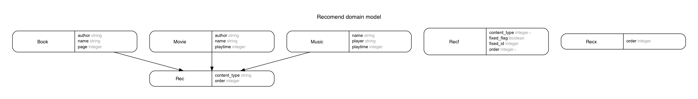

## レコメンデーションの練習

```
# ruby 2.4, rails 5 は事前にインストールして置く事

$ bundle install
$ bin/rails db:environment:set RAILS_ENV=development
$ rails db:migrate
$ rails db:reset

$ rails c
> Recx.make.map {|x| x.content.name }
=> => ["music-5", "book-9", "music-7", "movie-8", "music-8", "book-3", "book-7", "movie-3", "movie-7"]

> Rec.make.map {|x| x.content.name }
=> ["book-8", "movie-6", "music-3", "music-4", "book-4", "movie-5", "movie-2", "book-6", "music-6"]
```
make メソッドを実行する度に、異なる商品リストが得られていることが示されている。

Rec は polymorphic で、 Book, Music, Movie に結びつけている。

Recx は virtual attribute で content メンバーを定義し、そこに Book, Music, Movie を結びつけている。

